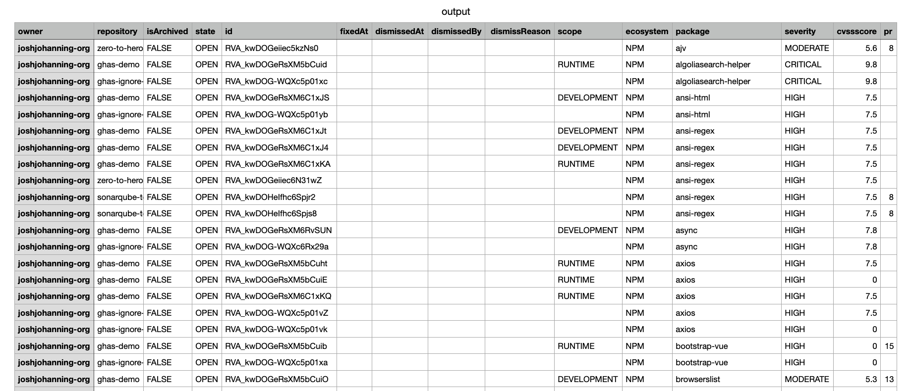

# Dependabot alerts helpers

Helper scripts to managed [dependabot alerts](https://docs.github.com/en/code-security/dependabot/dependabot-alerts/about-dependabot-alerts) in bulk.

The scripts can:

- Export alerts into a CSV, this enables opening the file in Excel for analysis, you can export alerts for multiple repositories.
- Dismiss alerts in bulk. Dismiss all alerts in the /CSV file generated by the alerts exporter.
- Merge PRs. Bulk merge all the pull requests that have been generated 
by dependabot. The list of PRs to merge will be picked by the CSV generated with the exporter.

> Note: There is no way to automatically undo the changes made by the scripts, so proceed with care and be sure of the actions you are going to take before proceeding.

## Requirements

- [GitHub CLI](https://cli.github.com)
- [JQ](https://stedolan.github.io/jq/)
- [csvtool](https://github.com/maroofi/csvtool) Only needed to dismiss alerts or merge alert pull requests.

## Running

### Exporting Alerts

Usage:

```bash
Usage: get-alerts.sh <reposfilename> [state]
optional state can have the following values:  OPEN FIXED DISMISSED 
```

> Note: Getting alerts from a high number of repos (and/or high number of alerts) may trigger GitHub rate limits and the scripts don't take into account those rate limits, so it's advisable for big orgs to export alerts in smaller chunks.

To generate the CSV with the list of alerts you need to feed the script with a file containing the list of repositories, there a second optional parameter (state) that allows you to only get alerts with a given state (OPEN FIXED or DISMISSED), if you omit this parameter all alerts will be exported regardless of their state.

The file should contain the list of repositories (one per line) in the format OWNER/REPOSITORY

```text
tspscoal-demo2/myshuttle
octocat/monalisa
```

The alerts will be sent to standard output, if you want to store the results into a file redirect the output to a file.

You can use the `generate-repos.sh` script to generate the list of repositories in a given organization.

> personal repositories are not supported in `generate-repos.sh` command, if you want to export the repositories for a given user you can use gh cli command `gh api users/USERNAME/repos --template '{{range .}}{{printf "%s/%s\n" .owner.login .name}}{{end}}`

Now that you are in possession of the alerts, you can open them in excel for filtering and analysis.

#### Example

```sh
# generate a list of repos
./generate-repos.sh my-org > repos.csv

# consolidate dependabot alerts into csv - only export OPEN results
./get-alerts repos.csv OPEN > output.csv
```

#### Sample

Sample output csv, sorted by package in excel



You are now ready to filter the alerts or do some analysis with a pivot table.

### Dismissing Alerts

Usage:

```bash
Usage: ./dismiss-alerts.sh <alertsfile> <reason>
reason can be one of :  FIX_STARTED INACCURATE NOT_USED NO_BANDWIDTH TOLERABLE_RISK
```

Once you have exported the alerts you can dismiss them in bulk. Just feed the script with the CSV file generated by the exporter.

> You probably don't want to dismiss all alerts, so you probably want to filter the alerts to dismiss some only based on a specific criteria (eg: alerts with low severity).

To dismiss the alerts, invoke `dismiss-alerts.sh` with the CSV file generated by the exporter and the reason for the dismissal.

These are the valid dismissal reasons

- FIX_STARTED
- INACCURATE
- NOT_USED
- NO_BANDWIDTH
- TOLERABLE_RISK

### Merging pull requests

Usage:

```bash
Usage: ./merge-prs.sh <alertsfile> <message> [merge method]
valid values for method are : merge squash rebase
default value for merge method is 'merge'
```

Dismissing alerts may be make sense in some circumstances, but it probably makes more sense to remediate the alerts for which dependabot has generated pull requests.

If you feed your alerts to the `merge-prs.sh` script, it will merge the PRs that have been generated by dependabot and whose state is `open`.

> By default the merge method is merge, but if you want you can use other methods. `merge`, `squash` and `rebase` are the supported methods.

This will allow you to merge PRs in bulk for a given potential vulnerability in all repos. For example merge all PRs for dependabot alerts generated to fix a given package (eg: `log4j`).
